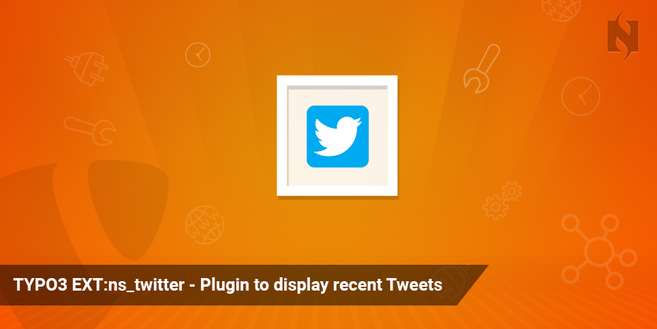
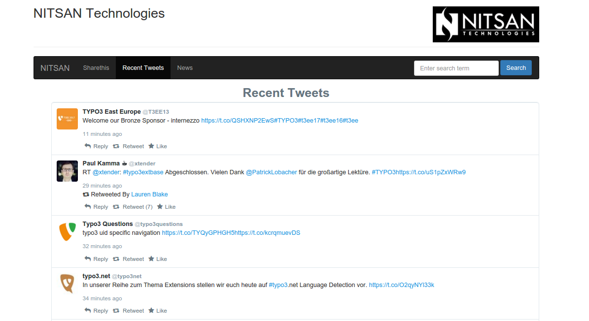


.. include:: ../Includes.txt

============
Introduction
============

ext:ns_twitter
===================

.. _What-does-it-do:

What does it do?
================

Twitter for Websites is a suite of tools bringing Twitter content and functionality to your website page with Like, Retweet and Reply etc., functionality to your tweets directly from your TYPO3 website. 

[NITSAN] Twitter TYPO3 Extension brings your all twitter timeline tweets to your TYPO3 site so your tweets will not be rate limited at Twitter!

.. _Screen-shots:

Screen Shot
================

